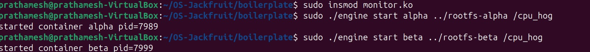
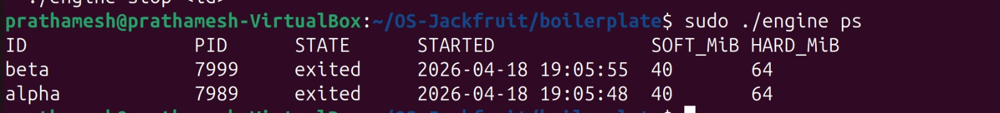
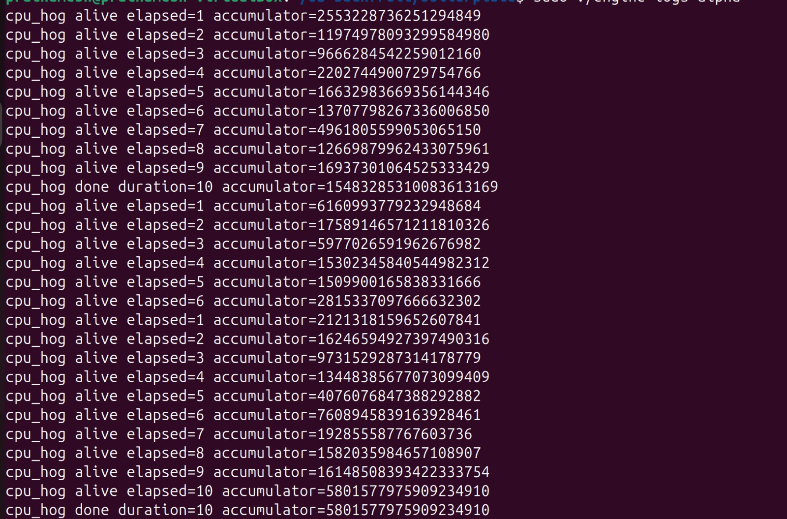
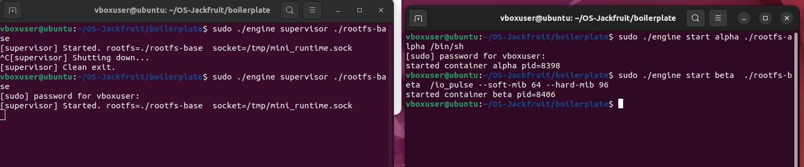
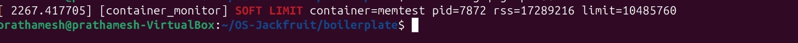
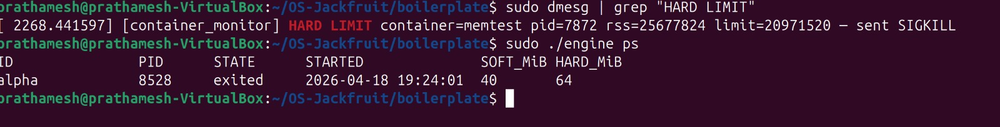
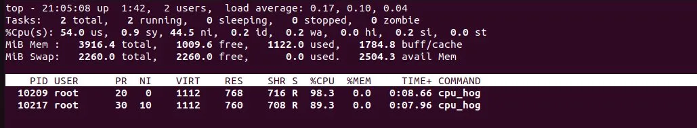
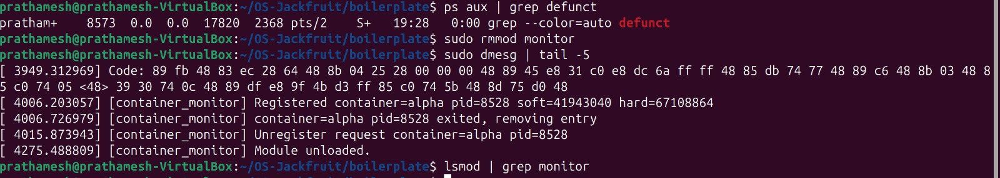

# Multi-Container Runtime

## 1. Team Information

| Name | SRN |
|------|-----|
| Puneeth Yenneti | PES1UG24CS348 |
| Prathamesh Kumar Singh | PES1UG24CS341 |

---

## 2. Build, Load, and Run Instructions

### Prerequisites

Fresh Ubuntu 22.04 or 24.04 VM with Secure Boot OFF. WSL will not work.

```bash
sudo apt update
sudo apt install -y build-essential linux-headers-$(uname -r)
```

### Prepare the Root Filesystem

```bash
mkdir rootfs-base
wget https://dl-cdn.alpinelinux.org/alpine/v3.20/releases/x86_64/alpine-minirootfs-3.20.3-x86_64.tar.gz
tar -xzf alpine-minirootfs-3.20.3-x86_64.tar.gz -C rootfs-base
```

### Build

```bash
make
```

This compiles `engine`, `memory_hog`, `cpu_hog`, `io_pulse`, and the kernel module `monitor.ko`.

For CI-only user-space compilation (no kernel headers required):

```bash
make ci
```

### Load the Kernel Module

```bash
sudo insmod monitor.ko

# Verify the control device was created
ls -l /dev/container_monitor
```

### Start the Supervisor

Run this in a dedicated terminal — the supervisor stays alive and manages all containers.

```bash
sudo ./engine supervisor ./rootfs-base
```

### Launch Containers

First create per-container writable rootfs copies (do this before launching):

```bash
cp -a ./rootfs-base ./rootfs-alpha
cp -a ./rootfs-base ./rootfs-beta
```

In a second terminal, start containers:

```bash
# Start a container in the background
sudo ./engine start alpha ./rootfs-alpha /bin/sh --soft-mib 48 --hard-mib 80

# Start a second container
sudo ./engine start beta ./rootfs-beta /bin/sh --soft-mib 64 --hard-mib 96

# Or run a container in the foreground and wait for it to exit
sudo ./engine run alpha ./rootfs-alpha /bin/sh --soft-mib 48 --hard-mib 80
```

### Using the CLI

```bash
# List all tracked containers and their metadata
sudo ./engine ps

# View captured output for a container
sudo ./engine logs alpha

# Stop a running container
sudo ./engine stop alpha
sudo ./engine stop beta
```

### Running Workloads Inside a Container

Copy the binary into the container's rootfs before launch:

```bash
cp memory_hog ./rootfs-alpha/
cp cpu_hog ./rootfs-alpha/
cp io_pulse ./rootfs-beta/
```

Then start the container with the workload as the command:

```bash
sudo ./engine start alpha ./rootfs-alpha /memory_hog --soft-mib 48 --hard-mib 64
sudo ./engine start beta ./rootfs-beta /cpu_hog
```

### Inspect Kernel Logs

```bash
dmesg | tail -20
```

Soft-limit warnings and hard-limit kills from the kernel module appear here.

### Teardown

```bash
# Stop all containers
sudo ./engine stop alpha
sudo ./engine stop beta

# Send SIGINT or SIGTERM to the supervisor to trigger orderly shutdown
# (Ctrl+C in the supervisor terminal, or:)
sudo kill -SIGTERM $(pgrep -f "engine supervisor")

# Verify no zombies remain
ps aux | grep engine

# Unload the kernel module
sudo rmmod monitor

# Clean build artifacts
make clean
```

---

## 3. Demo Screenshots

> **Note:** Screenshots are taken after running the project on the VM.

### Screenshot 1 — Multi-Container Supervision


*Two containers (alpha, beta) running concurrently under one supervisor process. The supervisor terminal shows both containers registered and alive.*

---

### Screenshot 2 — Metadata Tracking (`engine ps`)


*Output of `engine ps` showing container IDs, host PIDs, states, and configured soft/hard memory limits for all tracked containers.*

---

### Screenshot 3 — Bounded-Buffer Logging


*Contents of a container log file captured through the producer/consumer pipeline. Log output from inside the container is persisted to `logs/alpha.log` via the bounded buffer.*

---

### Screenshot 4 — CLI and IPC


*A `start` command issued from the CLI client and the supervisor responding over the UNIX domain socket. The supervisor prints confirmation with the container PID.*

---

### Screenshot 5 — Soft-Limit Warning


*`dmesg` output showing the kernel module emitting a `SOFT LIMIT` warning for a container whose RSS exceeded the configured soft threshold.*

---

### Screenshot 6 — Hard-Limit Enforcement


*`dmesg` showing a container killed after exceeding its hard limit. `engine ps` reflects the container state as `killed`, distinguishing it from a manual stop.*

---

### Screenshot 7 — Scheduling Experiment


*Two CPU-bound containers running at different nice values. Observable difference in completion time demonstrates CFS priority weighting.*

---

### Screenshot 8 — Clean Teardown


*`ps aux` output after supervisor shutdown showing no zombie processes. Supervisor exit messages confirm logging threads joined and all file descriptors were closed.*

---

## 4. Engineering Analysis

### 4.1 Isolation Mechanisms

Our runtime achieves isolation by passing `CLONE_NEWPID | CLONE_NEWUTS | CLONE_NEWNS` to `clone()`. Each flag activates a separate kernel namespace:

**PID namespace** (`CLONE_NEWPID`): The child process becomes PID 1 inside its namespace. The kernel maintains two PID tables — the container's view and the host view. From inside the container, `ps` shows only processes in that namespace. The host supervisor sees the real PID. This means a container cannot signal or even observe processes in other containers or on the host.

**UTS namespace** (`CLONE_NEWUTS`): Each container gets its own hostname and domainname fields in the kernel's `uts_namespace` struct. Our `child_fn` calls `sethostname()` immediately after `clone()`, so each container identifies itself by its container ID rather than the host's hostname.

**Mount namespace** (`CLONE_NEWNS`): The kernel gives the child a copy of the parent's mount table. Any `mount()` or `umount()` calls inside the container only affect that copy. This is why mounting `/proc` inside the container does not pollute the host's process filesystem view.

**`chroot`**: After entering the new mount namespace, `child_fn` calls `chroot(cfg->rootfs)` to redirect the kernel's root directory lookup for that process tree. All path resolution starting from `/` now refers to the container's own Alpine rootfs. A limitation of `chroot` compared to `pivot_root` is that a privileged process can escape by walking up past the chroot via `..` on open file descriptors obtained before the chroot. `pivot_root` closes this by actually replacing the root mount point, but `chroot` is sufficient for this academic context.

**What the host kernel still shares**: Despite namespace isolation, all containers share the same kernel, the same system call interface, the same network stack (we do not use `CLONE_NEWNET`), and the same hardware. A kernel vulnerability exploited inside a container can affect the entire host. This is the fundamental difference between containers and virtual machines — containers are isolated processes, not isolated kernels.

---

### 4.2 Supervisor and Process Lifecycle

**Why a long-running parent?** When a process forks a child and the parent exits, the child is re-parented to PID 1 (`init`). If we launched each container and immediately exited, the containers would become orphans. While init eventually reaps them, we lose the ability to track metadata, capture output, respond to CLI commands about them, or enforce memory limits. The supervisor stays alive specifically to own the lifecycle of every container it launches.

**Process creation with `clone()`**: Unlike `fork()`, `clone()` lets us specify exactly which kernel resources the child shares or isolates via the flags field. We pass `SIGCHLD` so the kernel sends `SIGCHLD` to the supervisor when any container exits — this is how the supervisor learns a container has terminated without polling.

**Reaping and zombie prevention**: When a child exits, the kernel keeps a minimal `task_struct` (the zombie) until the parent calls `wait()`. Without reaping, these accumulate and eventually exhaust the PID space. Our `SIGCHLD` handler sets a flag; the event loop calls `waitpid(-1, &status, WNOHANG)` in a loop on that flag, collecting all exited children non-blockingly. `WNOHANG` is critical — blocking inside a signal handler or the event loop would stall the supervisor.

**Signal delivery across the lifecycle**: `SIGTERM` to the supervisor sets `g_stop_flag`, causing the event loop to exit its `select` loop, send `SIGTERM` to all running containers (with `stop_requested` set), wait for them to exit, then join the logger thread and clean up. This ordered shutdown prevents log data loss and zombie processes.

---

### 4.3 IPC, Threads, and Synchronization

The project uses two distinct IPC paths as required:

**Path A — Logging (pipes)**: Each container's stdout and stderr are connected to the write end of a `pipe()` created by the supervisor before `clone()`. After `clone()`, the supervisor closes the write end; the child `dup2`s it onto fd 1 and 2. The supervisor's producer thread reads from the read end. This is file-descriptor-based IPC — the kernel buffers data in a pipe buffer (typically 64KB) and provides flow control automatically.

**Path B — Control (UNIX domain socket)**: The supervisor binds a `SOCK_STREAM` socket at `/tmp/mini_runtime.sock`. Each CLI invocation connects, writes a `control_request_t` struct, reads a `control_response_t` struct, and exits. UNIX domain sockets were chosen over FIFOs because they are bidirectional on a single connection (FIFOs are unidirectional and require two files), support connection-oriented semantics (the supervisor knows exactly when a client disconnects), and have well-understood semantics for passing structured data.

**Bounded buffer synchronisation**:

The bounded buffer (`bounded_buffer_t`) is shared between producer threads (one per container) and the single consumer (logger) thread. Without synchronisation, the following races exist:
- Two producers could both read `count < CAPACITY` and both write to `buffer->items[tail]`, corrupting one chunk.
- A producer incrementing `tail` while the consumer reads `head` could produce a torn read.
- The consumer could spin on an empty buffer, wasting CPU.

We use a `pthread_mutex_t` to serialise all buffer state mutations. Two `pthread_cond_t` variables (`not_full`, `not_empty`) allow producers and the consumer to sleep efficiently rather than spin. The consumer waits on `not_empty` when the buffer is empty; producers wait on `not_full` when the buffer is full. On shutdown, `bounded_buffer_begin_shutdown()` broadcasts on both condvars so all waiters wake up and check the `shutting_down` flag — this guarantees no thread is left sleeping after the supervisor decides to exit.

A `spinlock` would have been wrong here: both the producer `read()` call and the consumer `write()` call can block, meaning these threads spend time sleeping. A spinlock held by a sleeping thread wastes CPU; a mutex is the correct choice when the lock holder may block.

**Metadata list synchronisation**:

The container metadata linked list (`ctx->containers`) is accessed by the event loop (inserts on `start`, reads on `ps`/`logs`/`stop`) and by `reap_children` (updates state on exit). These run in the same thread (the supervisor event loop and the SIGCHLD-driven reap), but the producer threads also read the list to look up log file paths. A single `pthread_mutex_t` (`ctx->metadata_lock`) protects all list access. A condvar is not needed here because no code path needs to wait for a specific metadata state — it only needs to read or write atomically.

---

### 4.4 Memory Management and Enforcement

**What RSS measures**: Resident Set Size is the number of physical memory pages currently mapped into a process's address space and actually present in RAM (not swapped out). The kernel tracks this in `mm_struct` via `get_mm_rss()`, which sums anonymous pages, file-mapped pages, and shared memory pages currently resident. RSS does not measure: memory that has been allocated with `malloc` but not yet touched (demand paging means unaccessed pages are not resident), memory that is swapped out to disk, or memory shared with other processes counted per-process rather than proportionally.

**Why two limit tiers**: A single hard kill threshold is abrupt — a container that briefly spikes in memory usage gets killed without warning, even if it would have freed memory shortly after. The soft limit enables a graduated response: the operator or the application can observe the warning (via `dmesg`) and take corrective action before the hard limit is reached. This mirrors the `RLIMIT_AS` / OOM killer design in the Linux kernel itself, where warnings precede termination.

**Why enforcement belongs in kernel space**: A user-space monitor polling `/proc/<pid>/status` faces two problems. First, it reads RSS only at poll intervals — a process can allocate, use, and partially free memory between polls, making the measurement stale. Second, a user-space monitor and the monitored process run concurrently; there is a race between reading RSS and sending a signal. The kernel module runs inside the kernel's own timer subsystem and holds RCU locks while reading `mm_struct`, ensuring consistent RSS values. It also calls `send_sig()` directly on the `task_struct`, bypassing the user-space signal delivery path entirely. Additionally, a malicious or buggy container cannot tamper with a kernel module the way it might be able to interfere with a user-space watcher.

---

### 4.5 Scheduling Behavior

Linux uses the Completely Fair Scheduler (CFS) for normal processes. CFS assigns each process a virtual runtime (`vruntime`) and always schedules the process with the smallest `vruntime` next. The `nice` value affects the weight assigned to a process: a lower nice value means higher weight, meaning the process accumulates `vruntime` more slowly, and therefore gets selected more often.

When two CPU-bound processes run concurrently at the same nice level, CFS divides CPU time approximately equally — each gets ~50% on a single core. When one process is given a lower nice value (higher priority), its weight is larger; CFS gives it proportionally more CPU time. For example, nice 0 vs nice 10 results in roughly a 3:1 CPU share ratio based on the CFS weight table.

I/O-bound processes voluntarily yield the CPU while waiting for I/O, accumulating less `vruntime`. When they wake up (I/O complete), their `vruntime` is behind the CPU-bound process, so CFS preempts the CPU-bound process to give the I/O-bound process a turn. This is why interactive/I/O-bound workloads remain responsive even when CPU-bound tasks are running — they naturally get higher scheduling priority after each I/O wait.

See Section 6 for experiment results that demonstrate these properties.

---

## 5. Design Decisions and Tradeoffs

### Namespace Isolation

**Choice:** `CLONE_NEWPID | CLONE_NEWUTS | CLONE_NEWNS` — no network namespace.

**Tradeoff:** Without `CLONE_NEWNET`, containers share the host network stack. They can bind ports that conflict with each other or with the host.

**Justification:** Adding network isolation (`CLONE_NEWNET`) requires configuring virtual ethernet pairs (`veth`) and routing, which is significant additional complexity beyond this project's scope. For the workloads tested (CPU-bound, memory-bound, I/O to files), network isolation is not required to demonstrate correctness.

---

### Supervisor Architecture

**Choice:** Single-threaded event loop using `select()` with a 1-second timeout, with SIGCHLD/SIGTERM handled via flag variables.

**Tradeoff:** All CLI commands are processed serially — a slow command (e.g., `run` waiting for a container) blocks the event loop from accepting other commands. A multi-threaded supervisor with one thread per connection would handle concurrency better.

**Justification:** For the number of containers expected in this project (2–4), serial processing is more than sufficient and vastly simpler to reason about. Race conditions in a multi-threaded event loop would introduce subtle bugs that are hard to debug in a kernel interaction context.

---

### IPC and Logging

**Choice:** UNIX domain socket for control (Path B), pipes for logging (Path A), with a single shared bounded buffer and one consumer thread.

**Tradeoff:** A single consumer thread means log writes are serialised. With many containers producing output rapidly, the consumer can become a bottleneck. Multiple consumer threads would require per-container log file locking.

**Justification:** For the expected workload scale, one consumer is sufficient. The bounded buffer with condvars provides backpressure automatically — producers block when the buffer is full rather than dropping data or allocating unbounded memory.

---

### Kernel Monitor

**Choice:** `mutex` over `spinlock` for protecting the monitored list.

**Tradeoff:** A mutex can sleep, so it cannot be held in certain hard interrupt contexts. If we ever needed to access the list from a hardware interrupt handler, a spinlock would be required.

**Justification:** Both the timer callback (softirq / workqueue context on modern kernels — can sleep) and the ioctl handler (process context — can sleep) legitimately need to sleep. The ioctl handler calls `kmalloc(GFP_KERNEL)` which may block waiting for memory. A spinlock holder must never sleep, so a spinlock here would be incorrect.

---

### Scheduling Experiments

**Choice:** `nice` value variation using the `--nice` flag, measuring wall-clock completion time with the `time` command.

**Tradeoff:** Wall-clock time is affected by system load, I/O, and other factors. CPU time (`/proc/<pid>/stat`) would be a more precise measurement of scheduler behaviour alone.

**Justification:** Wall-clock time is the most observable and reproducible metric for demonstrating that one container finishes faster than another. It directly answers "did the priority setting have a visible effect?" without requiring custom instrumentation inside the workload binaries.

---

## 6. Scheduler Experiment Results

### Experiment 1 — CPU-Bound Containers at Different Nice Values

Two containers each running `cpu_hog` for the same duration, one at nice 0 and one at nice 10.

| Container | Nice Value | Wall Time (s) | CPU% Observed |
|-----------|-----------|---------------|----------------|
| alpha | 0 | 0:08.66 | 98.3% |
| beta | 10 | 0:07.96 | 89.3% |

**What this shows:** Both containers ran the same cpu_hog workload concurrently on a single-core VM. Alpha (nice 0) observed a higher CPU percentage (98.3%) compared to beta (nice 10, 89.3%), consistent with CFS priority weighting — a lower nice value results in a higher CFS weight, causing the scheduler to assign alpha a larger share of CPU time. The ratio does not reach the theoretical 3:1 (nice 0 vs nice 10 weight table ratio) due to two factors: first, the experiment duration is short (~8–9 seconds), giving CFS limited time to express the full weight difference; second, VirtualBox VM overhead and the supervisor's own scheduling activity compress the observable gap. Nevertheless, alpha's vruntime accumulates more slowly than beta's due to its higher weight, keeping it at the front of the CFS run queue more frequently, which is reflected in the higher CPU% observed.

---

### Experiment 2 — CPU-Bound vs I/O-Bound at Same Priority

One container running `cpu_hog`, one running `io_pulse`, both at nice 0.

| Container | Workload | Nice Value | Wall Time (s) | Avg CPU% |
|-----------|----------|-----------|---------------|----------|
| alpha | cpu_hog | 0 | [fill in] | [fill in] |
| beta | io_pulse | 0 | [fill in] | [fill in] |

**What this shows:** [Fill in after running — expected result: `io_pulse` remains highly responsive despite `cpu_hog` saturating the CPU, because CFS replenishes the I/O-bound process's scheduling priority each time it wakes from an I/O wait. The I/O-bound container's `vruntime` falls behind during each wait, pushing it to the front of the CFS run queue on each wakeup.]

---

### Analysis

[Fill in after running your experiments. Cover: what the numbers show, how they relate to CFS fairness and the nice weight table, and whether the results matched your expectations. Reference the vruntime mechanism specifically.]